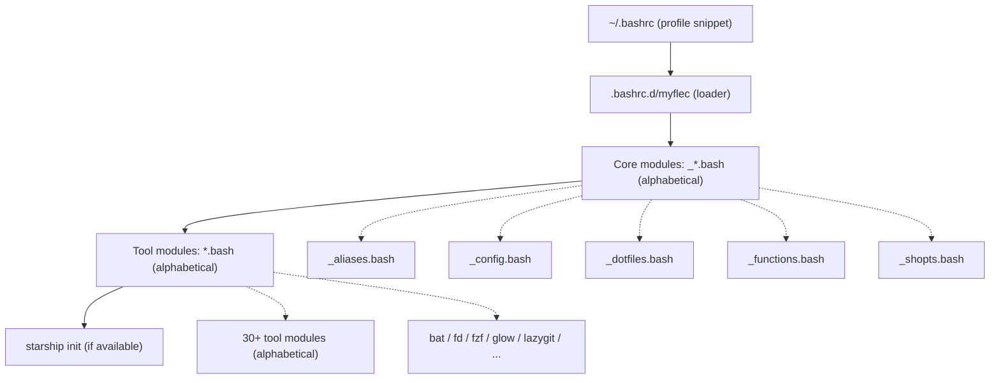
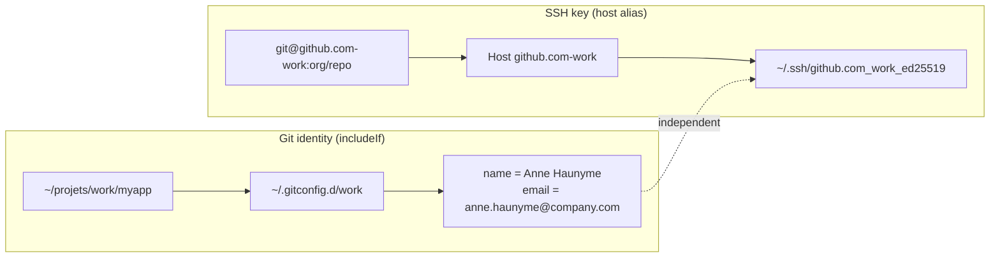
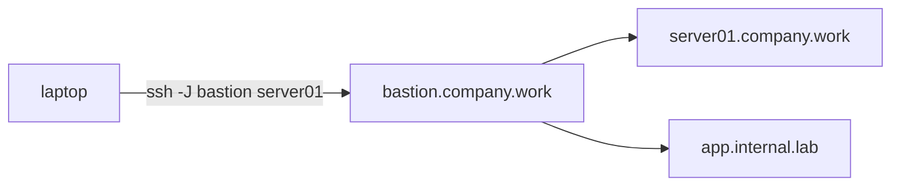
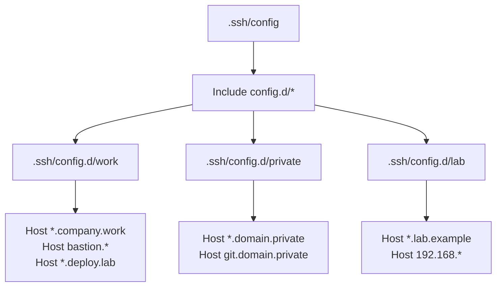

# MyFlec

[](https://www.gnu.org/software/bash/)
[](https://kernel.org/)
[](https://starship.rs/)
[](https://github.com/log0u7/myflec)
[](LICENSE)

My Favorite Linux Environment Configuration.


A modular collection of shell configurations, aliases, and helper functions
to enhance your Linux experience. Everything is optional: tools are guarded
by availability checks so MyFlec degrades gracefully when a tool is not
installed.

For my Vim setup, see [MyVim](https://github.com/log0u7/myvim).

## Table of Contents

- [Quick Start](#quick-start)
- [Deployment and Backup](#deployment-and-backup)
- [Modern Tooling](#modern-tooling)
- [Mise (polyglot tool manager)](#mise-polyglot-tool-manager)
- [Fnox (secrets management)](#fnox-secrets-management)
- [Changelog](CHANGELOG.md)
- [Module Reference](#module-reference)
- [SSH Identity Model](#ssh-identity-model)
- [Advanced SSH Patterns](#advanced-ssh-patterns)
- [Debug Mode](#debug-mode)
- [Requirements](#requirements)
- [Installation](#installation)
- [Contributing](#contributing)
- [Repositories](#repositories)
- [License](#license)

## Quick Start

If you want to version-control your `$HOME` with git (backup on a forge,
restore on a new machine in one command):

```bash
# Install MyFlec files to $HOME
git clone https://github.com/log0u7/myflec ~/myflec
cat ~/myflec/profile >> ~/.bashrc
rsync -av --exclude-from ~/myflec/myflec.exclude.lst ~/myflec/ ~/
. ~/.bashrc

# Create a bare dotfiles repo to track your configs
dotfiles-init git@github.com:user/dotfiles.git

# Start tracking your config files
echo "*" > ~/.gitignore         # ignore everything
echo "!.bashrc.d" >> ~/.gitignore
echo "!.gitconfig" >> ~/.gitignore
dot add .bashrc .gitignore

# Backup
dotfiles-backup "initial commit"
```

## Deployment and Backup

MyFlec provides two ways to deploy and backup your configuration.

### Method A: Bare git repo (recommended)

This method keeps `$HOME` under version control without symlinks or rsync.
A bare git repository at `~/.dotfiles` uses `$HOME` as the work tree.

#### First time: initialize

```bash
dotfiles-init git@github.com:user/dotfiles.git
```

This creates the bare repo, sets `status.showUntrackedFiles no` (so `dot status`
does not list your entire `$HOME`), and configures the remote.

#### Everyday use

```bash
dotfiles-status        # see what changed (short)
dotfiles-list          # list all tracked files
dot add .bashrc.d/foo.bash   # track a new file
dotfiles-backup "update foo" # add -u, commit, push in one step
```

The `dot` alias gives you direct git access for anything else:
```bash
dot log
dot diff
dot reset HEAD file
```

#### New machine: restore everything

```bash
dotfiles-restore git@github.com:user/dotfiles.git
```

Conflicting files are backed up to a temporary directory before checkout.

#### Backup on multiple forges

By default the repo backs up to one remote. Add extra push targets for
redundancy:

```bash
dotfiles-addbackup git@gitlab.com:user/dotfiles.git
dotfiles-addbackup git@notabug.org:user/dotfiles.git
dotfiles-remotes              # verify
dotfiles-removebackup git@notabug.org:user/dotfiles.git  # remove one
```

#### Function reference

| Function | What it does |
|---|---|
| `dotfiles-init <url> [url2 ...]` | Create a new bare repo with remote(s) |
| `dotfiles-restore <url>` | Clone an existing repo to `~/.dotfiles` and checkout |
| `dotfiles-status` | Short status of tracked files |
| `dotfiles-list` | List all tracked files |
| `dotfiles-backup [message]` | Add, commit, push in one command |
| `dotfiles-sync` | Pull (rebase) latest changes |
| `dotfiles-addbackup <url>` | Add a push URL (multi-forge) |
| `dotfiles-removebackup <url>` | Remove a push URL |
| `dotfiles-remotes` | Show all remotes and push URLs |

#### How it works

The bare repo technique uses `git --git-dir=$HOME/.dotfiles --work-tree=$HOME`.
The `dot` alias is created by `_dotfiles.bash` only when `~/.dotfiles` exists.
A `.gitignore` whitelist (ignore all, allow specific files) prevents
accidentally committing sensitive data.

### Method B: rsync (alternative)

If you do not want to version-control your `$HOME`, use rsync to deploy:

```bash
git clone https://github.com/log0u7/myflec
rsync -av --exclude-from 'myflec/myflec.exclude.lst' myflec/ ~/
cat myflec/profile >> ~/.bashrc
. ~/.bashrc
```

## Modern Tooling

MyFlec integrates a collection of modern CLI tools that you can use
immediately. Some run natively (faster, for frequent use), others run
via Docker (zero install, available at first command).

### Quick reference

| Need | Commands | Tool |
|---|---|---|
| Search files by content | `rg pattern` | ripgrep |
| Find files by name | `fd name` | fd |
| Read a file with syntax colors | `batp file` | bat |
| Fuzzy find (Ctrl-R for history, Ctrl-T for files) | `Ctrl-R` / `Ctrl-T` | fzf |
| Smart directory jump | `z project` | zoxide |
| Git interactive TUI | `lgit` | lazygit |
| Read markdown | `md README.md` | glow |
| Query markdown sections | `mdq '# section' file.md` | mdq |
| Process YAML | `yq '.key' file.yaml` | yq |
| Process JSON | `jq '.key' file.json'` | jq |
| Container TUI monitor | `ctop` | ctop |
| Container TUI manager | `lazydocker` | lazydocker |
| GitHub CLI | `gh pr`, `gh run` | gh |
| GitLab CLI | `glab mr`, `glab ci` | glab |
| Simplified man pages | `tldr tar` | tldr |
| Load env vars per directory | `direnv` (auto) | direnv |
| Searchable shell history | `atuin` (Ctrl-R) | atuin |
| Syntax-highlighted git pager | `git diff` (auto) | delta |

### Zero-install tools (Docker)

The following tools need no installation: they run via Docker and work the
first time you type the command.

`glow`, `yq`, `jq`, `ctop`, `lazydocker`, `dive`, `sherlock`

**Limitation**: tools that read local files (glow, yq, jq, mdq) mount the
current directory. They can only access files in `$PWD`, not absolute paths
outside it. Pipes work (`echo '{"a":1}' | jq '.'`).

### Native tools (via mise, recommended)

Install everything with one command:

```bash
mise use -g bat ripgrep fd fzf zoxide lazygit gh glab delta atuin direnv tlrc
```

All native tools are guarded by `command -v <tool>`. If not installed, the
module is skipped silently. MyFlec works with or without them.

### Coexistence notes

- **fzf vs atuin**: both hook Ctrl-R. Atuin takes over if both are present
  (atuin manages history search, fzf still works for Ctrl-T and Alt-C).
- **atuin up-arrow under bash**: requires a preexec provider (bash-preexec or
  ble.sh). Without one, up-arrow is disabled but Ctrl-R works. To enable
  up-arrow, install bash-preexec:
  `curl https://raw.githubusercontent.com/rcaloras/bash-preexec/master/bash-preexec.sh -o ~/.bash-preexec.sh`
- **zoxide vs shopt autocd**: coexists. `z` and `zi` add smart jumping on
  top of bash built-in `cd`.
- **cat not overridden**: `bat` provides `catp` (plain bat) as an alias.
  The `cat` command is left as the system default.
- **lgit vs git lg**: `lgit = lazygit` (shell) does not conflict with
  `git lg` (git alias, namespace is different).
- **delta is safe**: `GIT_PAGER` is set only when delta is actually
  installed. Git works normally without it.

### Git pager (delta)

When [delta](https://github.com/dandavison/delta) is installed, `git diff`,
`git log`, `git show` output is automatically syntax-highlighted with line
numbers. No `.gitconfig` change needed: `GIT_PAGER=delta` is set by
`delta.bash` at shell startup.

## Mise (polyglot tool manager)

[Mise](https://mise.jdx.dev/) manages development tools, environment
variables, and tasks from a single `mise.toml` file. It is the recommended
way to install and switch between language runtimes.

### Why mise?

- **Unified version management**: replace NVM, pyenv, rbenv, rustup, GOROOT
  with one tool. Automatically switches tool versions when you `cd` into a
  project directory.
- **Task runner**: define build, test, lint, and deploy commands in
  `mise.toml` under `[tasks]`. Run them with `mise run <task>`.
- **Environment loader**: load project-specific environment variables from
  `mise.toml` `[env]` or `.env` files.
- **900+ tools**: node, python, go, rust, terraform, jq, kubectl, and many
  more in the [registry](https://mise.jdx.dev/registry.html).

### Key commands

| Command | Alias | Purpose |
|---|---|---|
| `mise use node@20` | `miu` | Pin a tool version in `mise.toml` |
| `mise install` | `mii` | Install all tools from `mise.toml` |
| `mise run test` | `mir` | Run a task defined in `mise.toml` |
| `mise exec -- go build` | `mix` | Run a command with mise-managed tools |
| `mise list` | `mil` | List installed tool versions |
| `mise env` | `mie` | Show environment variables from mise config |
| `mise tasks` | `mit` | List available tasks |
| `mise upgrade` | `miup` | Update mise to the latest version |

### Integration with MyFlec

When mise is installed, `mise activate bash` runs at shell startup, setting
up shims and directory hooks. Tool-specific version managers (NVM, rustup,
manual GOROOT) are automatically disabled.

When mise is **not** installed, the existing version managers take over
transparently. No configuration change is needed.

### Example mise.toml

```toml
[tools]
node = "20"
python = "3.12"
go = "1.22"
rust = "1.78"
terraform = "1.9"

[env]
NODE_ENV = "development"

[tasks]
test = "go test ./... && cargo test"
lint = "golangci-lint run && cargo clippy"
```

A template file is available at [mise.toml.example](mise.toml.example).

## Fnox (secrets management)

[Fnox](https://fnox.jdx.dev/) manages secrets with multiple backends:
encrypted in git (age, AWS KMS, Azure KMS, GCP KMS) or referenced remotely
(AWS Secrets Manager, 1Password, Bitwarden, HashiCorp Vault, etc.).

### Why fnox?

- **Secrets in git (encrypted)**: store development secrets in the repository
  encrypted with age (works with SSH keys). Team members can clone and
  immediately access dev secrets.
- **Cloud secret storage**: reference secrets stored in AWS, Azure, GCP,
  1Password, Bitwarden, or Vault. No plaintext in config files.
- **Multi-environment profiles**: different secrets for dev, staging, and
  production in the same `fnox.toml`.
- **Shell integration**: secrets are automatically loaded when you `cd`
  into a directory containing a `fnox.toml` file.

### Key commands

| Command | Alias | Purpose |
|---|---|---|
| `fnox set DB_URL ...` | `fns` | Set a secret (encrypted inline) |
| `fnox get DB_URL` | `fng` | Get a secret value |
| `fnox list` | `fnl` | List all secret keys |
| `fnox delete DB_URL` | `fnd` | Delete a secret |
| `fnox exec -- npm start` | `fne` | Run a command with secrets loaded |
| `fnox edit` | `fnedit` | Edit fnox.toml interactively |

### Providers

| Provider | Type | Use case |
|---|---|---|
| age | Encryption (offline) | Secrets in git, works with SSH keys |
| aws-kms, azure-kms, gcp-kms | Cloud KMS | Encrypted secrets with cloud key management |
| aws-sm, azure-sm, gcp-sm | Cloud storage | Centralized secrets in cloud providers |
| 1password, bitwarden | Password manager | Reuse existing vaults |
| vault | Cloud storage | HashiCorp Vault for centralized secrets |

### Example fnox.toml

```toml
[providers]
age = { public_key = "age1..." }

[secrets]
DATABASE_URL = "ENC[AGE,...]"
API_KEY = { provider = "aws-sm", ref = "prod/api-key" }

[profiles.dev]
DATABASE_URL = "postgresql://localhost/dev"

[profiles.prod]
DATABASE_URL = { provider = "aws-sm", ref = "prod/db-url" }
```

A template file is available at [fnox.toml.example](fnox.toml.example).

## Module Reference

| Module | What it does | Type | Fallback |
|---|---|---|---|
| `myflec` | Loader: sources every `*.bash` module, starts Starship (Gruvbox Rainbow) | core | - |
| `.config/starship.toml` | Starship prompt config - Gruvbox Rainbow preset (Nerd Font required) | config | default prompt |
| `_config.bash` | Locale, history, pager (`most`), GCC colors, TERM | core | - |
| `_shopts.bash` | Bash `shopt` options (autocd, cdspell, completions, history) | core | - |
| `_aliases.bash` | Maps helper functions to short aliases (`calc`, `mkcd`, `extract`) | core | - |
| `_functions.bash` | Core helpers: `setup_tool_path`, `mkcd`, `extract`, `calc`, GPG cipher, host search | core | - |
| `_dotfiles.bash` | Bare git repo management for `$HOME` (`dotfiles-*` functions + `dot` alias) | core | git |
| `mise.bash` | Mise activation, short aliases (`mi`, `miu`, `mii`, ...), completion | tool | NVM/rustup/GOROOT |
| `fnox.bash` | Fnox auto-load hook, short aliases (`fn`, `fns`, `fng`, ...), completion | tool | GPG/SSH manual |
| `bat.bash` | `cat` alternative: `catp` / `catn`, `BAT_THEME` | tool | - |
| `ripgrep.bash` | `rg` config (`RIPGREP_CONFIG_PATH`) | tool | - |
| `fd.bash` | `find` alternative (fd stays fd, integrated with fzf) | tool | - |
| `fzf.bash` | Fuzzy finder: Ctrl-R, Ctrl-T, Alt-C, fd/bat integration | tool | - |
| `zoxide.bash` | Smart `cd` (`z` / `zi`), coexists with autocd | tool | - |
| `direnv.bash` | Per-directory env vars (auto-load on cd) | tool | - |
| `atuin.bash` | Searchable shell history (Ctrl-R, encrypted sync) | tool | - |
| `lazygit.bash` | Git TUI (`lgit`) | tool | - |
| `forge-cli.bash` | GitHub CLI (`gh`) and GitLab CLI (`glab`) completions + aliases | tool | - |
| `delta.bash` | Syntax-highlighted git pager (`GIT_PAGER=delta` if installed) | tool | - |
| `tldr.bash` | Simplified man pages (`tldr`) | tool | - |
| `glow.bash` | Markdown renderer in terminal (`glow` / `md`, Docker) | tool (docker) | - |
| `mdq.bash` | jq for markdown: query sections (`mdq`) | tool | - |
| `yq.bash` | YAML/JSON processor (`yq`, Docker) | tool (docker) | - |
| `jq.bash` | JSON processor (`jq`, Docker) | tool (docker) | - |
| `docker.bash` | Docker + Compose aliases, ctop, lazydocker, dive, sherlock | tool | docker |
| `python.bash` | Python aliases (`py`, `py3`), venv helpers, uv, poetry, pip fallback | tool | venv/pip |
| `go.bash` | Go aliases + project helpers (GOROOT/GOPATH fallback when mise absent) | tool | GOROOT |
| `rust.bash` | Rust/Cargo aliases (`ca` not `c`), rustup fallback when mise absent | tool | rustup |
| `nodejs.bash` | Node.js aliases (npm/yarn/pnpm), NVM fallback when mise absent | tool | NVM |
| `ssh.bash` | SSH key generation (`sshkg`, `sshadd`), completion | tool | - |
| `vim.bash` | Default editor (`vim`), `:q` detection via `$VIMRUNTIME` | tool | - |
| `lsd.bash` | `ls` replacement via lsd (`ls` / `lt`) | tool | - |
| `byobu.bash` | Byobu prompt integration | tool | - |
| `powerline.bash` | Optional Powerline integration (disabled by default) | tool | - |

### Load Order

The loader (`.bashrc.d/myflec`) is invoked from `~/.bashrc` via the `profile`
snippet. It sources core modules (prefixed `_`) first, then tool modules, both
in alphabetical order.



Note: `.bash_aliases` is sourced separately by the default Debian/Ubuntu
`.bashrc` before the profile snippet runs. It coexists with `.bashrc.d/` on
purpose and is kept as the native Debian mechanism.

## SSH Identity Model

### Purpose

When you work with multiple git forges and identities (personal, work,
self-hosted), two things must align: who you commit as (Git name/email)
and which account pushes the code (SSH key). These two concerns are
orthogonal:

- **Git identity** (name/email): driven by the repository directory via
  `includeIf "gitdir:..."` in `.gitconfig`. One identity per project tree.
- **SSH key** (which account): driven by the SSH host alias used in the
  remote URL. One key per alias.

Keeping them separate means you can commit as your work identity while
pushing to a personal fork, or vice versa.

### Usage

#### Host aliases

The default block for each forge uses the personal key. Extra identities
use a host alias (`<forge>-<label>`). Clone with the alias to use a
different key:

```bash
# personal (default)
git clone git@github.com:owner/repo.git

# work identity
git clone git@github.com-work:owner/repo.git
```

#### Correspondence table

| Project directory | Git identity (includeIf) | SSH remote |
|---|---|---|
| `~/projets/github/` | personal GitHub | `git@github.com:owner/repo` |
| `~/projets/gitlab/` | personal GitLab | `git@gitlab.com:owner/repo` |
| `~/projets/work/` | work identity | `git@github.com-work:owner/repo` |
| `~/projets/company/` | company identity | `git@git.company.work:team/project` |

#### Architecture diagrams

**Two orthogonal axes: Git identity vs SSH key**



**ProxyJump / bastion**



**Include organization**



### Internals

- **includeIf gitdir:** in `.gitconfig` matches a directory prefix. When a
  repository is inside `~/projets/work/`, the matching `[user]` section
  overrides the default identity.
- **Host alias pattern**: `<forge>-<label>` in `.ssh/config` lets you specify
  a different `IdentityFile` while keeping the real `HostName`. The remote
  URL `git@github.com-work:owner/repo` routes through the `Host github.com-work`
  stanza.
- **Key naming**: `<forge>_<label>_<type>` (e.g.
  `github.com_perso_ed25519`, `company.work_companyuser_ed25519`).
- **IdentitiesOnly yes**: prevents SSH from trying other keys (e.g. default
  `~/.ssh/id_rsa`) when a host-specific key is configured.
- **First match wins**: SSH config reads top to bottom, includes expanded at
  their point of inclusion. Put specific host blocks before wildcards in
  config files.

## Advanced SSH Patterns

Beyond the basic forge identities, OpenSSH supports a rich set of patterns
for multi-environment access, bastion hosts, tunnels, and more. Each pattern
below follows the same structure: what it does and why you would use it, how
to use it, and how it is configured.

This section documents every pattern used in `.ssh/config.d/work`,
`.ssh/config.d/private`, and `.ssh/config.d/lab`.

### 1. Self-hosted forges

**Purpose**: reach an internal git server (GitLab CE, Gitea, Forgejo, etc.)
behind a VPN or bastion. Same `User git` pattern as public forges.

**Usage**:

```bash
git clone git@git.company.work:team/project.git
```

**Config** (`.ssh/config.d/work`):

```
Host git.company.work
    HostName git.company.work
    User git
    IdentityFile ~/.ssh/company.work_companyuser_ed25519
    IdentitiesOnly yes
```

Git identity is set via `includeIf` in `.gitconfig`:

```
[includeIf "gitdir:~/projets/company/"]
    path = ~/.gitconfig.d/company
```

### 2. Jump hosts / bastions

**Purpose**: reach internal services through a single hardened bastion host
without exposing internal hosts to the internet. SSH automatically opens a
connection to the bastion, then forwards to the target.

**Usage**:

```bash
ssh app.internal.lab
# connects through bastion transparently
```

**Config** (`.ssh/config.d/work`):

```
Host bastion.company.work
    HostName jump.company.work
    User companyuser
    IdentityFile ~/.ssh/company.work_companyuser_ed25519
    IdentitiesOnly yes
    ForwardAgent yes
    Compression yes

Host app.internal.lab
    HostName app.internal.lab
    ProxyJump bastion.company.work
```

### 3. Chained ProxyJump

**Purpose**: traverse multiple hops when no single bastion can reach the
target directly (e.g. laptop -> bastion -> swarm manager -> deploy target).

**Usage**:

```bash
ssh machine.deploy.lab
```

**Config** (`.ssh/config.d/work`):

```
Host *.deploy.lab
    User deploy
    IdentityFile ~/.ssh/company.work_deploy_ed25519
    IdentitiesOnly yes
    ProxyJump bastion.company.work,swarm-manager.deploy.lab
```

ProxyJump accepts a comma-separated list: connections are chained left to
right.

### 4. Connection multiplexing

**Purpose**: reuse a single TCP connection for multiple SSH sessions. The
first SSH connection establishes a control socket; subsequent connections to
the same host reuse it, skipping TCP handshake, DNS, and authentication.

**Usage**:

```bash
ssh server01.company.work   # slow (TCP + auth)
ssh server01.company.work   # instant (reuses control socket)
```

**Config** (all `config.d` files):

```
ControlPath ~/.ssh/cm-%r@%h:%p
ControlMaster auto
ControlPersist 10m
```

- `ControlMaster auto`: reuse an existing socket if available, otherwise
  create one.
- `ControlPersist 10m`: keep the background master connection alive for 10
  minutes after the last session closes (avoids reconnecting on rapid
  open/close cycles).
- `ControlPath`: names the socket file. `%r` = remote user, `%h` = host,
  `%p` = port.

### 5. Wildcard hosts

**Purpose**: apply common settings to a group of hosts without repeating
them for every hostname.

**Usage**: any host matching the pattern inherits the stanza settings.

**Config** (`.ssh/config.d/lab`):

```
Host *.lab.example
    User labuser
    IdentityFile ~/.ssh/lab.example_labuser_ed25519
    IdentitiesOnly yes
    ControlPath ~/.ssh/cm-%r@%h:%p
    ControlMaster auto
    ControlPersist 30m
    Compression yes
    ConnectTimeout 10
```

**Order matters**: SSH reads config top to bottom, first match per parameter
wins. Put specific host blocks before wildcards define broad defaults after
them.

### 6. Multiple keys (fallback)

**Purpose**: use ed25519 as the primary key (fast, modern) and fall back to
rsa4096 when the server only supports RSA. SSH tries each listed key in
order until the server accepts one.

**Usage**: SSH automatically selects the first accepted key.

**Config** (`.ssh/config.d/private`):

```
Host *.domain.private
    User privateuser
    IdentityFile ~/.ssh/domain.private_privateuser_ed25519
    IdentityFile ~/.ssh/domain.private_privateuser_rsa4096
    IdentitiesOnly yes
```

- `IdentityFile` can appear multiple times; keys are tried in list order.
- `IdentitiesOnly yes` prevents SSH from trying unlisted keys (e.g. the
  default `~/.ssh/id_rsa`).

### 7. SOCKS proxy (dynamic forward)

**Purpose**: tunnel all traffic through a bastion for privacy or
network access. SOCKS5 works with browsers, `curl`, git, and most network
tools.

**Usage**:

```bash
# Start the tunnel (background, no shell)
ssh -f -N -D 9050 bastion.company.work

# Use it
curl --socks5 localhost:9050 https://internal.example.com
git clone git@git.company.work:team/project.git
```

**Config** (dedicated host stanza in `.ssh/config`):

```
Host socks5
    HostName jump.company.work
    User companyuser
    IdentityFile ~/.ssh/company.work_companyuser_ed25519
    IdentitiesOnly yes
    DynamicForward 9050
    ExitOnForwardFailure yes
    ServerAliveInterval 30
```

Then start with: `ssh -f -N socks5`

- `-D 9050`: open a SOCKS5 proxy on `localhost:9050`.
- `-f`: fork to background after authentication.
- `-N`: do not execute a remote command (no shell).

### 8. Port forwarding (tunnels)

**Purpose**: expose a single remote port on your local machine. Useful for
accessing web dashboards, databases, or any TCP service behind a bastion
without a SOCKS proxy.

**Usage**:

```bash
# Forward remote port 443 to localhost:4443
ssh -f -N -o ServerAliveInterval=30 -o ExitOnForwardFailure=yes \
    -L 0.0.0.0:4443:app.internal.lab:443 bastion.company.work

# Access the service locally
curl https://localhost:4443
```

**Config** (`.ssh/config.d/work`):

```
Host tunnel-app
    HostName bastion.company.work
    User companyuser
    IdentityFile ~/.ssh/company.work_companyuser_ed25519
    IdentitiesOnly yes
    LocalForward 4443 app.internal.lab:443
    ExitOnForwardFailure yes
    ServerAliveInterval 30
```

Then start with: `ssh -f -N tunnel-app`

- `-L 0.0.0.0:4443:target:443`: listen on all interfaces (`0.0.0.0`) on
  port `4443`, forward connections to `target:443` through the bastion.
- `-f`: fork to background (no shell).
- `-N`: do not execute a remote command (pure tunnel).
- `-o ServerAliveInterval=30`: send keepalive every 30 seconds, drop stale
  tunnels.
- `-o ExitOnForwardFailure=yes`: exit immediately if the forward cannot be
  established (avoids silent failures).

**Related patterns**:

| Flag | Name | Use case |
|---|---|---|
| `-L` | Local forward | Expose a remote port locally |
| `-R` | Remote forward | Expose a local port on the remote host |
| `-D` | Dynamic forward | SOCKS5 proxy (see previous section) |

## Debug Mode

Set `MYFLEC_DEBUG` to any non-empty value to print one confirmation line per
loaded module at shell startup. When unset (the default), startup is silent.

```bash
MYFLEC_DEBUG=1 bash -i
# + config configuration loaded
# + shopts configuration loaded
# + aliases configuration loaded
# ...
```

On terminals without UTF-8 support the check mark falls back to a plain
ASCII `+` character automatically.

## Requirements

Every optional tool is guarded by an availability check, so MyFlec degrades
gracefully when a tool is not installed. Tools marked "recommended" provide
the best experience; tools without install instructions are expected from
your distribution or brought in by mise.

### Install everything with mise (recommended)

```bash
mise use -g \
  bat ripgrep fd fzf zoxide lazygit gh glab delta atuin direnv tlrc \
  uv glow yq jq
```

This gives you all modern CLI tools with one command.

### Core

| Tool | Version | Purpose | Install |
|---|---|---|---|
| [starship](https://starship.rs/) | latest | Cross-shell prompt | `curl -sS https://starship.rs/install.sh \| sh` |
| [mise](https://mise.jdx.dev/) | 2024+ | Version manager, task runner, env loader | `curl https://mise.run \| sh` |
| [lsd](https://github.com/lsd-rs/lsd) | latest | Enhanced `ls` | `mise use -g lsd` |
| [most](https://www.jedsoft.org/most/) | latest | Pager with color support | `apt install most` |

### Workstations

| Tool | Version | Purpose | Install |
|---|---|---|---|
| [docker](https://docs.docker.com/) | latest | Container runtime | [Docker CE guide](https://docs.docker.com/engine/install/) |
| [byobu](https://byobu.org/) | latest | Terminal multiplexer | `apt install byobu` |
| [fnox](https://fnox.jdx.dev/) | 1.27+ | Secrets manager | `mise use -g fnox` |

### Modern CLI tools (native)

| Tool | Purpose | Install |
|---|---|---|
| [bat](https://github.com/sharkdp/bat) | `cat` with syntax highlighting | `mise use -g bat` |
| [ripgrep](https://github.com/BurntSushi/ripgrep) | Fast recursive grep | `mise use -g ripgrep` |
| [fd](https://github.com/sharkdp/fd) | Fast file search | `mise use -g fd` |
| [fzf](https://github.com/junegunn/fzf) | Fuzzy finder (Ctrl-R, Ctrl-T, Alt-C) | `mise use -g fzf` |
| [zoxide](https://github.com/ajeetdsouza/zoxide) | Smart cd (`z`) | `mise use -g zoxide` |
| [lazygit](https://github.com/jesseduffield/lazygit) | Git TUI (`lgit`) | `mise use -g lazygit` |
| [delta](https://github.com/dandavison/delta) | Syntax-highlighted git pager | `mise use -g delta` |
| [gh](https://cli.github.com/) | GitHub CLI | `mise use -g gh` |
| [glab](https://gitlab.com/gitlab-org/cli) | GitLab CLI | `mise use -g glab` |
| [atuin](https://atuin.sh/) | Searchable shell history | `mise use -g atuin` |
| [direnv](https://direnv.net/) | Per-directory env vars | `mise use -g direnv` |
| [tldr](https://tldr.sh/) | Simplified man pages | `mise use -g tlrc` (installs `tldr`) |
| [uv](https://docs.astral.sh/uv/) | Fast Python package manager | `mise use -g uv` |
| [poetry](https://python-poetry.org/) | Python dependency manager | `mise use -g poetry` |

### Zero-install tools (docker run)

| Tool | Purpose | Image |
|---|---|---|
| [glow](https://github.com/charmbracelet/glow) | Markdown renderer | `charmcli/glow:v2` |
| [yq](https://github.com/mikefarah/yq) | YAML/JSON processor | `mikefarah/yq:4` |
| [jq](https://jqlang.github.io/jq/) | JSON processor | `ghcr.io/jqlang/jq:1` |
| [mdq](https://github.com/yshavit/mdq) | jq for Markdown | `yshavit/mdq:v0.10.0` |
| ctop | Container top-like monitor | `quay.io/vektorlab/ctop` |
| lazydocker | Docker TUI | `lazyteam/lazydocker` |
| dive | Docker layer analysis | `wagoodman/dive` |
| sherlock | OSINT investigation | `sherlock/sherlock` |

### Language toolchains

| Tool | Version (min) | MyFlec fallback |
|---|---|---|
| node | 18+ | NVM (via `nodejs.bash`) |
| python | 3.10+ | System `python3` + venv (via `python.bash`) |
| go | 1.21+ | Manual `GOROOT=/usr/local/go` (via `go.bash`) |
| rust | 1.70+ | rustup (via `rust.bash`) |

### Optional tools

| Tool | Purpose | Module |
|---|---|---|
| `powerline-daemon` | Powerline status bar | `powerline.bash` |
| `golangci-lint` | Go linter | `go.bash` |
| `pipdeptree` | Python dependency tree | `python.bash` |

## Installation

This section describes how to deploy MyFlec itself (the public repository)
to your home directory. For version-controlling your own configs, see
[Deployment and Backup](#deployment-and-backup) above.

```bash
git clone https://github.com/log0u7/myflec
rsync -av --progress --exclude-from 'myflec/myflec.exclude.lst' myflec/ ~/
cat myflec/profile >> ~/.bashrc
. ~/.bashrc
```

## Contributing

Contributions are welcome. Please read [CONTRIBUTING.md](CONTRIBUTING.md)
before opening a pull request. See [CHANGELOG.md](CHANGELOG.md) for version
history.

## Repositories

| Forge | URL |
| --- | --- |
| GitHub | https://github.com/log0u7/myflec |
| GitLab | https://gitlab.com/log0u7/myflec |
| NotABug | https://notabug.org/log0u7/myflec |

## License

Released under the MIT License. See [LICENSE](LICENSE) for details.
