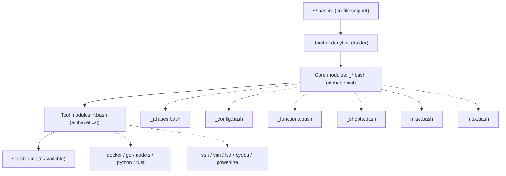

# MyFlec

[](https://www.gnu.org/software/bash/)
[](https://kernel.org/)
[](https://starship.rs/)
[](https://github.com/log0u7/myflec)
[](LICENSE)

My Favorite Linux Environment Configuration.

```
         _nnnn_
        dGGGGMMb
       @p~qp~~qMb
       M|@||@) M|
       @,----.JM|
      JS^\__/  qKL
     dZP        qKRb
    dZP          qKKb
   fZP            SMMb
   HZM            MMMM
   FqM            MMMM
 __| ".        |\dS"qML
 |    `.       | `' \Zq
_)      \.___.,|     .'
\____   )MMMMMP|   .'
     `-'       `--'
```

A modular collection of shell configurations, aliases, and helper functions
to enhance your Linux experience.

For my Vim setup, see [MyVim](https://github.com/log0u7/myvim).

## Table of Contents

- [Features](#features)
- [Load Order](#load-order)
- [Module Overview](#module-overview)
- [Mise (polyglot tool manager)](#mise-polyglot-tool-manager)
- [Fnox (secrets management)](#fnox-secrets-management)
- [SSH Identity Model](#ssh-identity-model)
- [Debug Mode](#debug-mode)
- [Requirements](#requirements)
- [Installation](#installation)
- [Version Control](#version-control)
- [Contributing](#contributing)
- [Repositories](#repositories)
- [License](#license)

## Features

### Shell Enhancements

- Custom aliases: enhanced `ls` via `lsd`, `extract` for archives, colored
  `hexedit`, inline `calc` powered by `bc`
- Optimized Bash options: autocompletion, directory navigation, timestamped
  history, locale, colored GCC output
- Terminal integration: Starship prompt, Byobu, optional Powerline

### Tool Management (Mise)

- [Mise](https://mise.jdx.dev/): polyglot version manager for node, python, go,
  rust, terraform, and 900+ other tools. Automatically switches versions per
  directory, manages env vars per project, and provides a unified task runner
  (`mise run`). Falls back to NVM/system Go/Rustup when mise is not installed.

### Secrets Management (Fnox)

- [Fnox](https://fnox.jdx.dev/): unified secrets management with encrypted
  secrets in git (age, KMS) or remote providers (AWS, Azure, GCP, 1Password,
  Bitwarden, Vault). Auto-loads secrets when entering a project directory.
  Works alongside built-in GPG helpers.

### Development Tools

- Python: virtualenv management, pip shortcuts, formatting and linting helpers
- Go: project scaffolding, build and test shortcuts, module management
- Rust: Cargo shortcuts (prefix `c` freed from alias collision), build automation
- Node.js: npm, yarn, and pnpm aliases, project scaffolding

### Docker Integration

- Container, image, volume, and network management shortcuts
- Docker Compose workflows
- Containerized tools: Sherlock (OSINT), Dive (layer analysis), Lazydocker

### SSH Management

- Key generation (`sshkg`), key adding (`sshadd`), agent helpers
- Per-context host configuration, jump hosts, connection persistence,
  host search (`searchhosts`)

### Git Configuration

- Context-aware identities based on repository path (work, GitHub, GitLab)
- Useful aliases and enhanced log visualization

## Load Order

The loader (`.bashrc.d/myflec`) is invoked from `~/.bashrc` via the `profile`
snippet. It sources core modules (prefixed `_`) first, then tool modules, both
in alphabetical order.



Note: `.bash_aliases` is sourced separately by the default Debian/Ubuntu
`.bashrc` before the profile snippet runs. It coexists with `.bashrc.d/` on
purpose and is kept as the native Debian mechanism.

## Module Overview

| File | Purpose |
| --- | --- |
| `myflec` | Loader: sources every `*.bash` module and initializes Starship |
| `_config.bash` | Locale, history, pager (`most`), GCC colors, terminal defaults |
| `_shopts.bash` | Bash `shopt` options |
| `_aliases.bash` | Maps helper functions to short aliases |
| `_functions.bash` | Core helpers: `mkcd`, `extract`, `calc`, GPG cipher, host search |
| `mise.bash` | Mise activation (`mise activate bash`), short aliases, completion |
| `fnox.bash` | Fnox activation (auto-load secrets on `cd`), short aliases, completion |
| `docker.bash` | Docker and Docker Compose aliases and containerized tools |
| `go.bash` | Go aliases and project management (GOROOT fallback when mise absent) |
| `python.bash` | Python and pip aliases, virtualenv helpers (pip fallback when mise absent) |
| `rust.bash` | Rust and Cargo aliases (rustup fallback when mise absent, alias `ca` not `c`) |
| `nodejs.bash` | Node.js, npm, yarn, pnpm aliases and project helpers (NVM fallback when mise absent) |
| `ssh.bash` | SSH key generation and agent helpers |
| `vim.bash` | Default editor configuration and aliases |
| `lsd.bash` | `lsd` drop-in aliases when `lsd` is available |
| `byobu.bash` | Byobu prompt integration |
| `powerline.bash` | Optional Powerline integration (disabled by default) |

Files prefixed with `_` are core modules loaded before tool-specific ones.
`mise.bash` and `fnox.bash` are loaded early (after `_functions.bash`) so that
`mise activate bash` configures the PATH before tool modules look for
executables.

## Mise (polyglot tool manager)

[Mise](https://mise.jdx.dev/) manages development tools, environment variables,
and tasks from a single `mise.toml` file. It is the recommended way to install
and switch between language runtimes (Node.js, Python, Go, Rust, etc.) in MyFlec.

### Why mise?

- **Unified version management**: replace NVM, pyenv, rbenv, rustup, GOROOT
  with one tool. Automatically switches tool versions when you `cd` into a
  project directory.
- **Task runner**: define build, test, lint, and deploy commands in
  `mise.toml` under `[tasks]`. Run them with `mise run <task>`.
- **Environment loader**: load project-specific environment variables from
  `mise.toml` `[env]` or `.env` files.
- **900+ tools**: node, python, go, rust, terraform, jq, kubectl, and many
  more in the [registry](https://mise.jdx.dev/registry.html).

### Integration with MyFlec

When mise is installed, `mise activate bash` runs at shell startup, setting up
shims and directory hooks. Tool-specific version managers (NVM, rustup, manual
GOROOT) are automatically disabled -- mise handles version switching instead.

When mise is **not** installed, the existing version managers take over
transparently. No configuration change is needed.

### Key commands

| Command | Alias | Purpose |
| --- | --- | --- |
| `mise use node@20` | `miu` | Pin a tool version in `mise.toml` |
| `mise install` | `mii` | Install all tools from `mise.toml` |
| `mise run test` | `mir` | Run a task defined in `mise.toml` |
| `mise exec -- go build` | `mix` | Run a command with mise-managed tools |
| `mise list` | `mil` | List installed tool versions |
| `mise env` | `mie` | Show environment variables from mise config |
| `mise tasks` | `mit` | List available tasks |
| `mise upgrade` | `miup` | Update mise to the latest version |

### Example mise.toml

```toml
[tools]
node = "20"
python = "3.12"
go = "1.22"
rust = "1.78"
terraform = "1.9"

[env]
NODE_ENV = "development"

[tasks]
test = "go test ./... && cargo test"
lint = "golangci-lint run && cargo clippy"
```

A template file is available at [mise.toml.example](mise.toml.example).

## Fnox (secrets management)

[Fnox](https://fnox.jdx.dev/) manages secrets with multiple backends:
encrypted in git (age, AWS KMS, Azure KMS, GCP KMS) or referenced remotely
(AWS Secrets Manager, 1Password, Bitwarden, HashiCorp Vault, etc.).

### Why fnox?

- **Secrets in git (encrypted)**: store development secrets in the repository
  encrypted with age (works with SSH keys). Team members can clone and
  immediately access dev secrets.
- **Cloud secret storage**: reference secrets stored in AWS, Azure, GCP,
  1Password, Bitwarden, or Vault. No plaintext in config files.
- **Multi-environment profiles**: different secrets for dev, staging, and
  production in the same `fnox.toml`.
- **Shell integration**: secrets are automatically loaded when you `cd` into
  a directory containing a `fnox.toml` file.

### Integration with MyFlec

Fnox runs a lightweight shell hook (`fnox load`) before each prompt. When you
enter a project directory with a `fnox.toml`, secrets are loaded into the
environment automatically. No-op when no `fnox.toml` is present.

Fnox complements the built-in GPG cipher helpers (`gpgc`, `gpgu`) for
scenarios that need cloud providers or team sharing.

### Key commands

| Command | Alias | Purpose |
| --- | --- | --- |
| `fnox set DB_URL ...` | `fns` | Set a secret (encrypted inline) |
| `fnox get DB_URL` | `fng` | Get a secret value |
| `fnox list` | `fnl` | List all secret keys |
| `fnox delete DB_URL` | `fnd` | Delete a secret |
| `fnox exec -- npm start` | `fne` | Run a command with secrets loaded |
| `fnox edit` | `fnedit` | Edit fnox.toml interactively |

### Providers

| Provider | Type | Use case |
| --- | --- | --- |
| age | Encryption (offline) | Secrets in git, works with SSH keys |
| aws-kms, azure-kms, gcp-kms | Cloud KMS | Encrypted secrets with cloud key management |
| aws-sm, azure-sm, gcp-sm | Cloud storage | Centralized secrets in cloud providers |
| 1password, bitwarden | Password manager | Reuse existing vaults |
| vault | Cloud storage | HashiCorp Vault for centralized secrets |

### Example fnox.toml

```toml
[providers]
age = { public_key = "age1..." }

[secrets]
DATABASE_URL = "ENC[AGE,...]"
API_KEY = { provider = "aws-sm", ref = "prod/api-key" }

[profiles.dev]
DATABASE_URL = "postgresql://localhost/dev"

[profiles.prod]
DATABASE_URL = { provider = "aws-sm", ref = "prod/db-url" }
```

A template file is available at [fnox.toml.example](fnox.toml.example).

## SSH Identity Model

Two orthogonal axes control identity when working with git forges:

- **Git identity (name/email)**: driven by the repository directory via
  `includeIf "gitdir:..."` in `.gitconfig`. One identity per project tree.
- **SSH key (which account)**: driven by the SSH host alias used in the
  remote URL. One key per alias.

### Host aliases

The default block for each forge uses the personal key. Extra identities use
a host alias (`<forge>-<label>`). Clone with the alias to use a different key:

```bash
# personal (default)
git clone git@github.com:owner/repo.git

# work identity
git clone git@github.com-work:owner/repo.git
```

Key naming convention: `<forge>_<label>_<type>`
(e.g. `github.com_perso_ed25519`, `gitlab.com_work_ed25519`).

### Correspondence table

| Project directory | Git identity (includeIf) | SSH remote to use |
| --- | --- | --- |
| `~/projets/github/` | personal GitHub identity | `git@github.com:owner/repo` |
| `~/projets/gitlab/` | personal GitLab identity | `git@gitlab.com:owner/repo` |
| `~/projets/work/` | work identity | `git@github.com-work:owner/repo` |

The two axes are independent: you can commit as your work identity in a
directory while pushing to a personal fork, or vice versa.

## Debug Mode

Set `MYFLEC_DEBUG` to any non-empty value to print one confirmation line per
loaded module at shell startup. When unset (the default), startup is silent.

```bash
MYFLEC_DEBUG=1 bash -i
# + config configuration loaded
# + shopts configuration loaded
# + aliases configuration loaded
# ...
```

On terminals without UTF-8 support the check mark falls back to a plain
ASCII `+` character automatically.

## Requirements

Every optional tool is guarded by an availability check, so MyFlec degrades
gracefully when a tool is not installed. Tools marked "recommended" provide
the best experience; tools without install instructions are expected from
your distribution or brought in by mise.

### Core (recommended)

| Tool | Version | Purpose | Install |
| --- | --- | --- | --- |
| [starship](https://starship.rs/) | latest | Cross-shell prompt | `curl -sS https://starship.rs/install.sh \| sh` |
| [mise](https://mise.jdx.dev/) | 2024+ | Polyglot version manager, task runner, env loader | `curl https://mise.run \| sh` |
| [lsd](https://github.com/lsd-rs/lsd) | latest | Enhanced `ls` replacement | `cargo install lsd` or `mise use -g lsd` |
| [most](https://www.jedsoft.org/most/) | latest | Pager with color support | `apt install most` or `brew install most` |

### Workstations (recommended)

| Tool | Version | Purpose | Install |
| --- | --- | --- | --- |
| [byobu](https://byobu.org/) | latest | Terminal multiplexer | `apt install byobu` |
| [docker](https://docs.docker.com/) | latest | Container runtime | [Docker CE install guide](https://docs.docker.com/engine/install/) |
| [fnox](https://fnox.jdx.dev/) | 1.27+ | Secrets manager (age, cloud, pass) | `mise use -g fnox` or `cargo install fnox` |

### Language toolchains (via mise, recommended)

| Tool | Version (min) | Purpose | MyFlec fallback |
| --- | --- | --- | --- |
| node | 18+ | Node.js runtime + npm | `nvm` (via `nodejs.bash`) |
| python | 3.10+ | Python interpreter + pip | System `python3` (via `python.bash`) |
| go | 1.21+ | Go compiler + tools | Manual `GOROOT=/usr/local/go` (via `go.bash`) |
| rust | 1.70+ | Rust toolchain + cargo | `rustup` (via `rust.bash`) |

Install with mise:
```bash
mise use -g node@lts python@latest go@latest rust@latest
```

### Language toolchains (system/manual alternatives)

If mise is not used, the following are expected for the corresponding modules
to be fully functional:

| Tool | Purpose | Install (Debian/Ubuntu) |
| --- | --- | --- |
| `python3` + `pip` | Python runtime | `apt install python3 python3-pip` |
| `go` | Go compiler | `apt install golang-go` or [golang.org](https://go.dev/dl/) |
| `rustup` | Rust toolchain installer | `curl --proto '=https' --tlsv1.2 -sSf https://sh.rustup.rs \| sh` |
| `nvm` | Node.js version manager | [nvm install script](https://github.com/nvm-sh/nvm#installing-and-updating) |

### Optional tools

| Tool | Purpose | Module |
| --- | --- | --- |
| `powerline-daemon` | Powerline status bar | `powerline.bash` |
| `sherlock/sherlock` (docker) | OSINT investigation | `docker.bash` |
| `wagoodman/dive` (docker) | Docker layer analysis | `docker.bash` |
| `lazyteam/lazydocker` (docker) | Docker TUI management | `docker.bash` |
| `golangci-lint` | Go linter | `go.bash` |
| `pipdeptree` | Python dependency tree | `python.bash` |

## Installation

```bash
git clone https://github.com/log0u7/myflec
rsync -av --progress --exclude-from 'myflec/myflec.exclude.lst' myflec/ ~/
cat myflec/profile >> ~/.bashrc
. ~/.bashrc
```

## Version Control

The recommended workflow keeps `$HOME` out of git entirely. Use `rsync` to
deploy the repository to your home directory, and keep sensitive files
(real host configurations, private keys, real identities) out of version
control.

If you want to track your own `$HOME` in a private repository:

> **Warning:** use private repositories only and never track unencrypted
> secrets, private keys, or real host configurations.

1. Copy `.gitignore` to your home directory:

   ```bash
   cp myflec/.gitignore ~/
   ```

   Adjust the exceptions in `.gitignore` to match your setup.

2. Initialize the repository:

   ```bash
   git init
   git remote add origin your_repository_url
   git add -A
   git commit -m "Initial commit"
   git push -u origin main
   ```

## Contributing

Contributions are welcome. Please read [CONTRIBUTING.md](CONTRIBUTING.md)
before opening a pull request.

## Repositories

| Forge | URL |
| --- | --- |
| GitHub | https://github.com/log0u7/myflec |
| GitLab | https://gitlab.com/log0u7/myflec |
| NotABug | https://notabug.org/log0u7/myflec |

## License

Released under the MIT License. See [LICENSE](LICENSE) for details.
