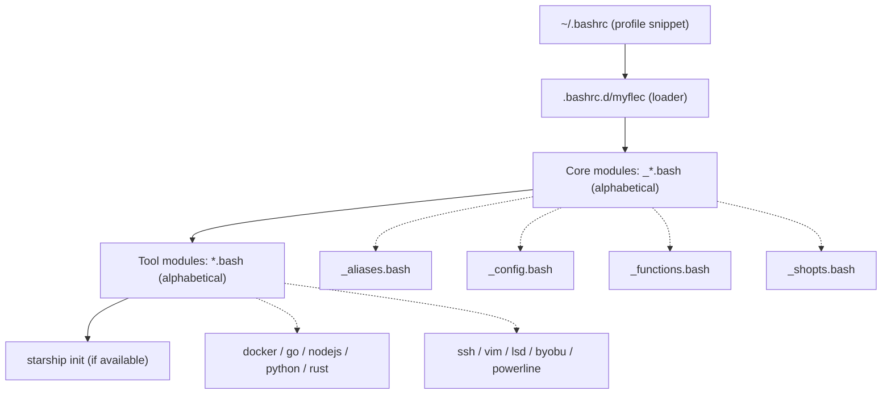

# MyFlec

[](https://www.gnu.org/software/bash/)
[](https://kernel.org/)
[](https://starship.rs/)
[](https://github.com/log0u7/myflec)
[](LICENSE)

My Favorite Linux Environment Configuration.

```
         _nnnn_
        dGGGGMMb
       @p~qp~~qMb
       M|@||@) M|
       @,----.JM|
      JS^\__/  qKL
     dZP        qKRb
    dZP          qKKb
   fZP            SMMb
   HZM            MMMM
   FqM            MMMM
 __| ".        |\dS"qML
 |    `.       | `' \Zq
_)      \.___.,|     .'
\____   )MMMMMP|   .'
     `-'       `--'
```

A modular collection of shell configurations, aliases, and helper functions
to enhance your Linux experience.

For my Vim setup, see [MyVim](https://github.com/log0u7/myvim).

## Table of Contents

- [Features](#features)
- [Load Order](#load-order)
- [Module Overview](#module-overview)
- [SSH Identity Model](#ssh-identity-model)
- [Debug Mode](#debug-mode)
- [Requirements](#requirements)
- [Installation](#installation)
- [Version Control](#version-control)
- [Contributing](#contributing)
- [Repositories](#repositories)
- [License](#license)

## Features

### Shell Enhancements

- Custom aliases: enhanced `ls` via `lsd`, `extract` for archives, colored
  `hexedit`, inline `calc` powered by `bc`
- Optimized Bash options: autocompletion, directory navigation, timestamped
  history, locale, colored GCC output
- Terminal integration: Starship prompt, Byobu, optional Powerline

### Development Tools

- Python: virtualenv management, pip shortcuts, formatting and linting helpers
- Go: project scaffolding, build and test shortcuts, module management
- Rust: Cargo shortcuts, build automation, documentation generation, linting
- Node.js: npm, yarn, and pnpm aliases, NVM integration, project scaffolding

### Docker Integration

- Container, image, volume, and network management shortcuts
- Docker Compose workflows
- Containerized tools: Sherlock (OSINT), Dive (layer analysis), Lazydocker

### SSH Management

- Key generation (`sshkg`), key adding (`sshadd`), agent helpers
- Per-context host configuration, jump hosts, connection persistence,
  host search (`searchhosts`)

### Git Configuration

- Context-aware identities based on repository path (work, GitHub, GitLab)
- Useful aliases and enhanced log visualization

## Load Order

The loader (`.bashrc.d/myflec`) is invoked from `~/.bashrc` via the `profile`
snippet. It sources core modules (prefixed `_`) first, then tool modules, both
in alphabetical order.



Note: `.bash_aliases` is sourced separately by the default Debian/Ubuntu
`.bashrc` before the profile snippet runs. It coexists with `.bashrc.d/` on
purpose and is kept as the native Debian mechanism.

## Module Overview

| File | Purpose |
| --- | --- |
| `myflec` | Loader: sources every `*.bash` module and initializes Starship |
| `_config.bash` | Locale, history, pager (`most`), GCC colors, terminal defaults |
| `_shopts.bash` | Bash `shopt` options |
| `_aliases.bash` | Maps helper functions to short aliases |
| `_functions.bash` | Core helpers: `mkcd`, `extract`, `calc`, GPG cipher, host search |
| `docker.bash` | Docker and Docker Compose aliases and containerized tools |
| `go.bash` | Go environment variables and aliases |
| `python.bash` | Python and pip aliases, virtualenv helpers |
| `rust.bash` | Rust and Cargo aliases |
| `nodejs.bash` | Node.js, npm, yarn, pnpm aliases and project helpers |
| `ssh.bash` | SSH key generation and agent helpers |
| `vim.bash` | Default editor configuration and aliases |
| `lsd.bash` | `lsd` drop-in aliases when `lsd` is available |
| `byobu.bash` | Byobu prompt integration |
| `powerline.bash` | Optional Powerline integration (disabled by default) |

Files prefixed with `_` are core modules loaded before tool-specific ones.

## SSH Identity Model

Two orthogonal axes control identity when working with git forges:

- **Git identity (name/email)**: driven by the repository directory via
  `includeIf "gitdir:..."` in `.gitconfig`. One identity per project tree.
- **SSH key (which account)**: driven by the SSH host alias used in the
  remote URL. One key per alias.

### Host aliases

The default block for each forge uses the personal key. Extra identities use
a host alias (`<forge>-<label>`). Clone with the alias to use a different key:

```bash
# personal (default)
git clone git@github.com:owner/repo.git

# work identity
git clone git@github.com-work:owner/repo.git
```

Key naming convention: `<forge>_<label>_<type>`
(e.g. `github.com_perso_ed25519`, `gitlab.com_work_ed25519`).

### Correspondence table

| Project directory | Git identity (includeIf) | SSH remote to use |
| --- | --- | --- |
| `~/projets/github/` | personal GitHub identity | `git@github.com:owner/repo` |
| `~/projets/gitlab/` | personal GitLab identity | `git@gitlab.com:owner/repo` |
| `~/projets/work/` | work identity | `git@github.com-work:owner/repo` |

The two axes are independent: you can commit as your work identity in a
directory while pushing to a personal fork, or vice versa.

## Debug Mode

Set `MYFLEC_DEBUG` to any non-empty value to print one confirmation line per
loaded module at shell startup. When unset (the default), startup is silent.

```bash
MYFLEC_DEBUG=1 bash -i
# + config configuration loaded
# + shopts configuration loaded
# + aliases configuration loaded
# ...
```

On terminals without UTF-8 support the check mark falls back to a plain
ASCII `+` character automatically.

## Requirements

Every optional tool is guarded by an availability check, so MyFlec degrades
gracefully when a tool is not installed. Recommended tools for the full
experience:

| Tool | Purpose |
| --- | --- |
| [lsd](https://github.com/lsd-rs/lsd) | Enhanced `ls` replacement |
| [starship](https://starship.rs/) | Cross-shell prompt |
| [most](https://www.jedsoft.org/most/) | Pager with color support |
| [byobu](https://byobu.org/) | Terminal multiplexer |
| [docker](https://docs.docker.com/) | Container runtime |
| nvm | Node.js version manager |
| go, rustup, python3 | Language toolchains |

## Installation

```bash
git clone https://github.com/log0u7/myflec
rsync -av --progress --exclude-from 'myflec/myflec.exclude.lst' myflec/ ~/
cat myflec/profile >> ~/.bashrc
. ~/.bashrc
```

## Version Control

The recommended workflow keeps `$HOME` out of git entirely. Use `rsync` to
deploy the repository to your home directory, and keep sensitive files
(real host configurations, private keys, real identities) out of version
control.

If you want to track your own `$HOME` in a private repository:

> **Warning:** use private repositories only and never track unencrypted
> secrets, private keys, or real host configurations.

1. Copy `.gitignore` to your home directory:

   ```bash
   cp myflec/.gitignore ~/
   ```

   Adjust the exceptions in `.gitignore` to match your setup.

2. Initialize the repository:

   ```bash
   git init
   git remote add origin your_repository_url
   git add -A
   git commit -m "Initial commit"
   git push -u origin main
   ```

## Contributing

Contributions are welcome. Please read [CONTRIBUTING.md](CONTRIBUTING.md)
before opening a pull request.

## Repositories

| Forge | URL |
| --- | --- |
| GitHub | https://github.com/log0u7/myflec |
| GitLab | https://gitlab.com/log0u7/myflec |
| NotABug | https://notabug.org/log0u7/myflec |

## License

Released under the MIT License. See [LICENSE](LICENSE) for details.
